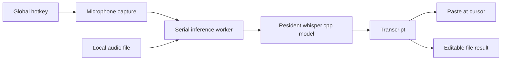

# WhisperApp

**Local dictation for macOS. Hold a key, speak, and release to paste text at the cursor.**

A native Swift menu-bar app built around whisper.cpp. Transcription runs on your Mac;
audio is not sent to a transcription service. The model downloads once, then dictation
works offline without a per-use API charge.

[Build and run](#build-and-run) · [Engineering](#engineering) · [Evaluation](#evaluation)

## What it does

1. **Hold Right Option (`⌥`)** to record. A red status dot and a short sound confirm capture.
2. **Release the key** to transcribe locally. The yellow dot blinks during processing.
3. **Continue typing** after the transcript is pasted. A blue dot reports that the insertion operation completed; the previous clipboard is restored by default.

The activation key, hold/toggle mode, clipboard behavior, cue volume, and status-dot colors
are configurable. File transcription converts local English `.m4a` and `.wav` recordings
of up to 30 minutes into editable text. Live dictation takes priority over file work.
An optional deterministic pass formats spoken dates and times.

**Status:** a personal desktop tool distributed as source. There is no notarized download
or portable release bundle. The built app and macOS permission entry are still named
`whisper`; **WhisperApp** is the repository name.

## Engineering

- **Resident inference engine:** Swift calls whisper.cpp through a small C bridge. The model stays loaded between utterances, with inference serialized away from the main thread.
- **Explicit dictation states:** the controller coordinates hotkey input, microphone capture, transcription, and insertion through replaceable protocols, which allows deterministic tests without a live microphone.
- **Desktop integration:** an Accessibility event tap provides the global hotkey; pasteboard insertion restores prior clipboard contents. The app's own feedback editor uses direct text insertion.
- **Responsive file jobs:** chunked file transcription yields to live dictation, then resumes. Cancelled files retain completed chunks as an editable partial result.
- **Stable development signing:** a persistent local signing identity avoids a changed Accessibility identity on each rebuild.



## Build and run

The current build targets **Apple Silicon**, **macOS 14.6 or later**, and **Swift 6**.
It links Homebrew libraries under `/opt/homebrew`; Intel Macs are not supported by these
build instructions. Install Xcode or a compatible Swift toolchain first.

```sh
git clone https://github.com/wbfrancis/WhisperApp.git
cd WhisperApp
brew install whisper-cpp ggml
scripts/make-signing-cert.sh  # once: creates the local whisper-dev identity
scripts/bundle.sh            # builds and signs build/whisper.app
open build/whisper.app
```

Grant **Microphone** and **Accessibility** access to `whisper` when prompted. First launch
downloads the `large-v3-turbo` Q5_0 model (about 547 MB) into
`~/Library/Application Support/whisper/models/` and warms up the engine.

Use the signed app bundle for interactive dictation. A bare executable can receive a new
ad-hoc signing identity after a rebuild and lose its Accessibility grant. The bundle links
local Homebrew libraries and is not suitable for copying to an unprepared Mac.

## Evaluation

```sh
swift test      # automated behavior and adapter tests
swift run eval  # local audio fixtures; requires the downloaded model
```

The [fixture set](fixtures/README.md) contains 20 clips covering pace, volume, quiet speech,
and realistic dictation. The harness reports mean per-clip word error rate (WER), ignoring
case and punctuation after text normalization. It is a small development set, not a
representative speech-recognition benchmark.

The [August 2026 prototype measurements](prototype/RESULTS.md) recorded **1.39 seconds**
for a warm CLI run on a synthetic 8.7-second utterance, using whisper.cpp 1.9.2 with Metal
on an M-series Mac with eight performance cores. An in-process latency estimate of about
1–1.1 seconds subtracts model-load time; it is not an end-to-end app benchmark. Cold startup
was much slower, which motivated resident inference and startup warm-up.

Automated tests do not prove that every external app accepts a pasted transcript. Live
microphone, permissions, and app-integration checks remain separate manual checks.

## Project map

| Location | Purpose |
| --- | --- |
| [`Sources/DictationKit`](Sources/DictationKit) | Dictation controller, engine, audio, insertion, and settings |
| [`Sources/CWhisper`](Sources/CWhisper) | C bridge to whisper.cpp |
| [`Sources/whisper`](Sources/whisper) | Menu-bar app and macOS UI |
| [`Tests/DictationKitTests`](Tests/DictationKitTests) | Automated tests |
| [`fixtures`](fixtures) | Audio evaluation corpus and scoring instructions |
| [`prototype/RESULTS.md`](prototype/RESULTS.md) | Early latency and insertion experiments |

Built with Swift, AppKit, AVFoundation, and whisper.cpp using OpenAI's Whisper model.
WhisperApp is an independent personal project, not an official OpenAI application.
